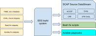

# Welcome!

[](https://github.com/ComplianceAsCode/content/releases/latest)
[](https://jenkins.complianceascode.io/job/scap-security-guide-nightly-zip/lastSuccessfulBuild/artifact/scap-security-guide-nightly.zip)
[](https://jenkins.complianceascode.io/job/scap-security-guide-nightly-oval510-zip/lastSuccessfulBuild/artifact/scap-security-guide-nightly-oval-510.zip)
[](https://jenkins.complianceascode.io/job/scap-security-guide-linkcheck/)
[](https://ci.centos.org/job/openscap-scap-security-guide/)
[](https://travis-ci.org/OpenSCAP/scap-security-guide)
[](https://scrutinizer-ci.com/g/ComplianceAsCode/content/?branch=master)
[](https://jenkins.complianceascode.io/job/scap-security-guide-stats/Statistics/)

<a href="docs/readme_images/report_sample.png"></a>

The purpose of this project is to create *security policy content* for various
platforms -- *Red Hat Enterprise Linux*, *Fedora*, *Ubuntu*, *Debian*, ... --
as well as products -- *Firefox*, *Chromium*, *JRE*, ...
Our aim is to make it as easy as possible to write new and maintain existing
security content in all the commonly used formats.

## We build security content in various formats

 &nbsp; &nbsp;  &nbsp; &nbsp; 

*"SCAP content"* refers to documents  in the *XCCDF*, *OVAL* and
*Source DataStream* formats.  These documents can be presented
in different forms and by different organizations to meet their security
automation and technical implementation needs.  For general use we
recommend *Source DataStreams* because they contain all the data you
need to evaluate and put machines into compliance. The datastreams are
part of our release ZIP archives.

*"Ansible content"* refers to Ansible playbooks generated from security
profiles.  These can be used both in check-mode to evaluate compliance,
as well as run-mode to put machines into compliance.  We publish these
on *Ansible Galaxy* as well as in release ZIP archives.

*"Bash fix files"* refers to *Bash* scripts generate from security
profiles.  These are meant to be run on machines to put them into
compliance.  We recommend using other formats but understand that for
some deployment scenarios bash is the only option.

### Why?

We want multiple organizations to be able to efficiently develop security
content. By taking advantage of the powerful build system of this project,
we avoid as much redundancy as possible.

The build system combines the easy-to-edit YAML rule files with OVAL checks,
Ansible task snippets, Bash fixes and other files. Templating is provided
at every step to avoid boilerplate. Security identifiers
(CCE, NIST ID, STIG, ...) appear in all of our output formats but are all
sourced from the YAML rule files.

We understand that depending on your organization's needs you may need
to use a specific security content format. We let you choose.



---
We use an OpenControl-inspired YAML rule format for input. Write once and
generate security content in XCCDF, Ansible and others.

```YAML
prodtype: rhel7

title: 'Configure The Number of Allowed Simultaneous Requests'

description: |-
    The <tt>MaxKeepAliveRequests</tt> directive should be set and configured to
    <sub idref="var_max_keepalive_requests" /> or greater by setting the following
    in <tt>/etc/httpd/conf/httpd.conf</tt>:
    <pre>MaxKeepAliveRequests <sub idref="var_max_keepalive_requests" /></pre>

rationale: |-
    Resource exhaustion can occur when an unlimited number of concurrent requests
    are allowed on a web site, facilitating a denial of service attack. Mitigating
    this kind of attack will include limiting the number of concurrent HTTP/HTTPS
    requests per IP address and may include, where feasible, limiting parameter
    values associated with keepalive, (i.e., a parameter used to limit the amount of
    time a connection may be inactive).

severity: medium

identifiers:
    cce: "80551-5"
```

---

### Scan targets

Our security content can be used to scan bare-metal machines, virtual machines,
virtual machine images (qcow2 and others), containers (including Docker) and
container images.

We use platform checks to detect whether we should or should not evaluate some
of the rules. For example: separate partition checks make perfect sense on bare-metal
machines but go against recommended practices on containers.

## Installation

### From packages

The preferred method of installation is via the package manager of your
distribution. On *Red Hat Enterprise Linux* and *Fedora* you can use:

```bash
yum install scap-security-guide
```

On Debian (sid), you can use:

```bash
apt install ssg-debian  # for Debian guides
apt install ssg-debderived  # for Debian-based distributions (e.g. Ubuntu) guides
apt install ssg-nondebian  # for other distributions guides (RHEL, Fedora, etc.)
apt install ssg-applications  # for application-oriented guides (Firefox, JBoss, etc.)
```

### From release ZIP files

Download pre-built SSG zip archive from
[the release page](https://github.com/ComplianceAsCode/content/releases/latest).
Each zip file is an archive with ready-made SCAP source datastreams.

### From COPR

We maintain a COPR repository that provides unofficial builds of latest versions
of openscap, scap-security-guide, scap-workbench and openscap-daemon.
The packages are suitable for use on Red Hat Enterprise Linux 6 and 7 and CentOS 6 and 7.

See https://copr.fedorainfracloud.org/coprs/openscapmaint/openscap-latest/ for
detailed instructions.

### From source

If ComplianceAsCode is not packaged in your distribution (it may be present there as `scap-security-guide` package), or if the
version that is packaged is too old, you need to build the content yourself
and install it via `make install`. Please see the [Developer Guide](docs/manual/developer_guide.adoc)
document for more info. We also recommend opening an issue on that distributions
bug tracker to voice interest.

## Usage

We assume you have installed ComplianceAsCode system-wide into a
standard location from current upstream sources as instructed in the previous section.

There are several ways to consume ComplianceAsCode content, we will only
go through a few of them here.

### `oscap` tool

The `oscap` tool is a low-level command line interface that comes from
the OpenSCAP project. It can be used to scan the local machine.

```bash
oscap xccdf eval --profile xccdf_org.ssgproject.content_profile_rht-ccp --results-arf arf.xml --report report.html --oval-results /usr/share/xml/scap/ssg/content/ssg-rhel7-ds.xml
```

After evaluation, the `arf.xml` file will contain all results in a reusable
*Result DataStream* format, `report.html` will contain a human readable
report that can be opened in a browser.

Replace the profile with other profile of your choice, you can display
all possible choices using:

```bash
oscap info /usr/share/xml/scap/ssg/content/ssg-rhel7-ds.xml
```

Please see the [OpenSCAP User Manual](https://static.open-scap.org/openscap-1.2/oscap_user_manual.html)
for more info.

### SCAP Workbench

The SCAP Workbench is a graphical user interface for SCAP evaluation and
customization. It is suitable for scanning a single machine, either local
or remote (via SSH). New versions of SCAP Workbench have SSG integration
and will automatically offer it when the application is started.

Please see the
[SCAP Workbench User Manual](https://static.open-scap.org/scap-workbench-1.1/)
for more info.

### `oscap-ssh` tool

`oscap-ssh` comes bundled with OpenSCAP 1.2.3 and later. It allows scanning
a remote machine via SSH with an interface resembling the `oscap` tool.

The following command evaluates machine with IP `192.168.1.123` with content
stored on local machine. Keep in mind that `oscap` has to be installed on the
remote machine but the SSG content doesn't need to be.

```bash
oscap-ssh root@192.168.1.123 22 xccdf eval --profile xccdf_org.ssgproject.content_profile_usgcb-rhel6-server --results-arf arf.xml --report report.html /usr/share/xml/scap/ssg/content/ssg-rhel6-ds.xml
```

### Ansible

To see a list of available Ansible Playbooks, run:

```bash
# ls /usr/share/scap-security-guide/ansible/
...
rhel6-playbook-standard.yml
rhel6-playbook-stig-rhel6-server-upstream.yml
rhel6-playbook-usgcb-rhel6-server.yml
rhel7-playbook-C2S.yml
rhel7-playbook-cjis-rhel7-server.yml
rhel7-playbook-common.yml
rhel7-playbook-docker-host.yml
rhel7-playbook-cui.yml
...
```

These Ansible Playbooks are generated from *SCAP* profiles available for the products.

To apply the playbook on your local machine run:
(*THIS WILL CHANGE CONFIGURATION OF THE MACHINE!*)

```bash
ansible-playbook -i "localhost," -c local /usr/share/scap-security-guide/ansible/rhel7-playbook-rht-ccp.yml
```

Each of the Ansible Playbooks contain instructions on how to deploy them. Here
is a snippet of the instructions:

```YAML
...
# This file was generated by OpenSCAP 1.2.16 using:
#   $ oscap xccdf generate fix --profile rht-ccp --template urn:xccdf:fix:script:ansible sds.xml
#
# This script is generated from an OpenSCAP profile without preliminary evaluation.
# It attempts to fix every selected rule, even if the system is already compliant.
#
# How to apply this remediation role:
# $ ansible-playbook -i "192.168.1.155," playbook.yml
# $ ansible-playbook -i inventory.ini playbook.yml
...
```

### Bash
To see a list of available Bash scripts, run:

```bash
# ls /usr/share/scap-security-guide/bash/
...
rhel7-script-hipaa.sh
rhel7-script-ospp.sh
rhel7-script-pci-dss.sh
...
```

These Bash scripts are generated from *SCAP* profiles available for the products.
Similar to Ansible Playbooks, each of the Bash scripts contain instructions on how to deploy them.

## Support

The SSG mailing list can be found at [https://lists.fedorahosted.org/mailman/listinfo/scap-security-guide](https://lists.fedorahosted.org/mailman/listinfo/scap-security-guide).

If you encounter issues with OpenSCAP or SCAP Workbench, use [https://www.redhat.com/mailman/listinfo/open-scap-list](https://www.redhat.com/mailman/listinfo/open-scap-list)

You can also join the `#openscap` IRC channel on `chat.freenode.net`.

## A little bit of history

This project started in 2011 as a collaboration between government agencies and
commercial operating system vendors. The original name was SCAP Security Guide.
The original scope was to create SCAP datastreams. Over time, it grew into the
biggest open-source beyond-SCAP content project.

The next few years saw the introduction of not just government-specific security
profiles but also commercial, such as PCI-DSS.

Later, the industry starting moving towards different security content formats,
such as Ansible, Puppet and Chef InSpec. The community reacted by evolving the
tooling and helped transform SSG into a more general-purpose security content
project. This change happened over time in 2017 and 2018. In September 2018, we
decided to change the name of the project to avoid confusion.

We envision that the future will be format-agnostic. That's why opted for an
abstraction instead of using XCCDF for the input format.

## Further reading

The SSG homepage is [https://www.open-scap.org/security-policies/scap-security-guide/](https://www.open-scap.org/security-policies/scap-security-guide/).

* [SSG User Manual](docs/manual/user_guide.adoc)
* [SSG Developer Guide](docs/manual/developer_guide.adoc)
